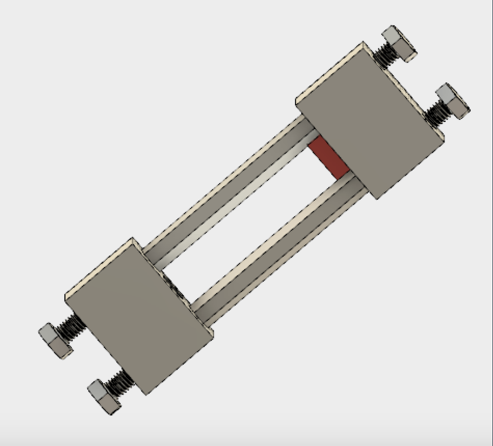
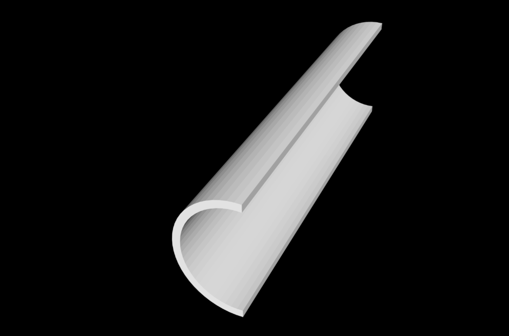

# Sensor Development, Fall 2018
#### Dana Owens, Lawrence Li, Lois Lee
#### September 25, 2018
[Shuo: Hello Sensor Development, I'll write my comments in the square brackets like this. Please feel free to delete these brackets after revising or updating your report. Basically, the content in this manual looks good. As for the style and format, we expect more graphs or diagrams. You don't need to worry much about how much points you get for this draft since it's only the first draft. Focus on where you can improve next time. Looking forward to your next report!]

## Abstract

The objective of the Sensor Development subteam is to develop sensors to monitor water quality during the water treatment process. In previous semesters, the subteam developed a working prototype for an in-lab fluidized bed solids detector and also made considerable progress towards prototyping a submersible sludge blanket detector. This semester the subteam will work on finalizing a product-level version of the in-lab fluidized bed solids detector with a more intuitive user interface. The subteam will also work on finishing and determining the best prototype for the sludge blanket detector. 

## Introduction

The Sensor Development team aims to create sensors that monitor and report water quality. These sensors can be used in many different steps of the water treatment process. Specifically, these sensors can be used to measure the efficiency of the treatment process and help catch problems if they arise. Originally, the Sensor Development subteam worked on developing a gas measurement sensor that would help subteams such as the Anaerobic Fluidized Bed (AFB) Reactor and Upflow Anaerobic Sludge Blanket (UASB) wastewater subteams with their research. 

The following semester, the subteam worked on a fluidized bed solids concentration sensor in order to measure the clay particle concentration in the high rate sedimentation portion of the water treatment process. Over the past year the subteam has concentrated on redefining the fluidized bed solids concentration sensor and building a submersible solids concentration sensor to measure turbidity. 

This semester, the team hopes to redesign the in-lab fluidized bed solids detector and make it more user-friendly by creating a user interface. The subteam is also currently developing a design for the finalized in-lab fluidized bed solids detector using 3D printing and embedded circuitry that will make the sensor both easier and safer to use. This sensor should ultimately provide the HRS team with a fast method of testing the concentration of clay particles within their testing parameters.  In addition, the subteam is looking into submersibility design options for the turbidity sensor. The goal of the subteam is to finish prototyping the MIA and the MAPE turbidity sensors, which are two design ideas the subteam developed for the submersible sensor the previous semester. The objective for this sensor is mainly to provide the treatment plant operators with a way to determine the height of the sludge blanket in a way that is both cost-efficient and easy to use. The sensors should help provide insight and information as to what is happening in the plants. 

## Previous Work

Last semester, the sensor development subteam worked on developing the mobile application-processed endoscope (MAPE) turbidity sensor, which could be lowered into sedimentation tanks to measure the distance to the sludge blanket. The sensor utilizes an endoscope to take live images of the water, which are collected and processed for average light intensity by the mobile application component. This sensor enables the calculation of the fluid turbidity from each image. This calculation uses an empirically obtained correlation between turbidity and the intensity of reflected light, as well as offset for any light detected during calibration in clear fluid. The goal of this sensor is to readily measure water turbidity and determine the height of the sludge blanket in a sedimentation tank.

Additionally, the subteam worked on the microcontroller-interfaced analog (MIA) sensor, which houses an analog photodiode, a LED light source, and a microcontroller within a portable casing. Similar to the MAPE turbidity sensor, the MIA sensor measures the fluid turbidity using light intensity. However, this sensor detects light passing through the fluid using a photodiode, which is more reliable and less susceptible to noise. The microcontroller reads the data from the photosensor and converts it into turbidity values, using a relation established through calibration testing. This sensor serves as a prototype for a larger device that will function similarly to the MAPE turbidity sensor, providing treatment plant operators with affordable and user-friendly methods of determining fluid turbidity and the height of the sludge blanket. 

Figure 1: The above figure shows the endoscope extension that was designed to improve accuracy of the camera and remove other confounding variables.

## Methods
Explain the techniques you have used to acquire additional data and insights. Reserve fine detail for the Manual at the end of the report, but use this section to give an overview with enough detail for the reader to understand your Results and Analysis. Describe your apparatus, and have a justification for every decision you made and every parameter you chose in the design of the apparatus. Be especially careful to detail the conditions your experiments were conducted under, as this information is especially important for interpreting your results

Below, some example sections are given. Sectioning the report is meant to keep similar information together.  Continue making sections as necessary, or delete sections if you do not need them. Feel free to add subsubsections to further delineate the information. For example, under the Experimental Apparatus section below, the EStaRS team might consider having sections such as "Filter Design" and "Filter Fabrication".

# Manual

## Fabrication Details
Include any information related to the fabrication of equipment, experimental apparatuses, or technologies. Include the purpose of each step and the fabrication methods used. Reference appropriate safety precautions.

### Fabrication for the Fluidized Beds Solids Detector

The main fabrication for the Fluidized Beds Solids Detector is creating a hard shell that allows the sensor to be more user friendly. The hard shell is made using the software OnShape to create a 3D model of the casing that is eventually printed in a 3D printer. The model is designed by creating a hollow circular base with an inner radius of 0.875 inches and an outer radius of 1.0 inch. Then the base is extruded 6.5 inches and cut in half using a plane that runs parallel to the sensor.

Figure 2: The model created using the software OnShape. Two copies of this model are 3D printed in order to create a complete casing that will surround the pipe that the sensor will be used on.

This design also requires that we line the casing with foam. The foam should be 2.48 inches wide, 0.18 inches deep and 6.25 inches long. This foam houses both the LED and the photosensor which are embedded into the foam.

## Special Components
### Special Components for the Fluidized Beds Solids Detector 

The photosensor used is the TEMT6000 Ambient Light Sensor made by SparkFun. TEMT6000 is a silicon NPN epitaxial planar phototransistor in a miniature transparent mold for surface mounting onto a printed circuit board. The device is sensitive to wavelengths from 390 nm to 700 nm. It is available [here](https://www.sparkfun.com/products/8688). 

We also utilized an LED from adafruit, available [here](https://www.adafruit.com/product/1626). The LED has dimensions of 12 mm by 40 mm. This LED is the best choice because it is a plastic diffused backlight, allowing even distribution of light throughout the system, which will minimize the effect on the calibration curve that the positioning of the photosensor may create. 

The other parts necessary for this sensor are wire and female and male headers which are comonly available. They are also available as [female headers](https://www.adafruit.com/product/2940) and [male headers](https://www.adafruit.com/product/3009) on Adafruit as well.

## Experimental Methods
### Set-up:

#### Current Experimental Methods
Because we are currently in the fabrication process, we are not able to test the sensor.

#### Future Experimental Methods
To develop a voltage-concentration relation for the fluidized bed solids detector, we will attach it to the High Rate Sedimentation recirculator (straight PVC pipe) and experiment with fluids of known solids concentration and turbidity. The photosensor will output a voltage reading based on the amount of light absorbed. We will analyze the recorded voltage output data for a relation between voltage and absorbance. Using the known concentrations of the fluids, we will be able to find a relation between concentration and absorbance, and thus concentration and voltage. 

We will use our calculated voltage-concentration relation to test the sensor on fluids of different known concentrations and record the calculated concentrations from the sensor. As a result, we can test the accuracy of the photosensor and our relation formulas by comparing the measured concentration/turbidity data to the actual concentrations of the fluids. It may also be necessary to test the effects of different types, particularly different colors, of sediment on the turbidity readings. However, we are not yet at the testing phase and have no experimentation details yet to report.

  
 

