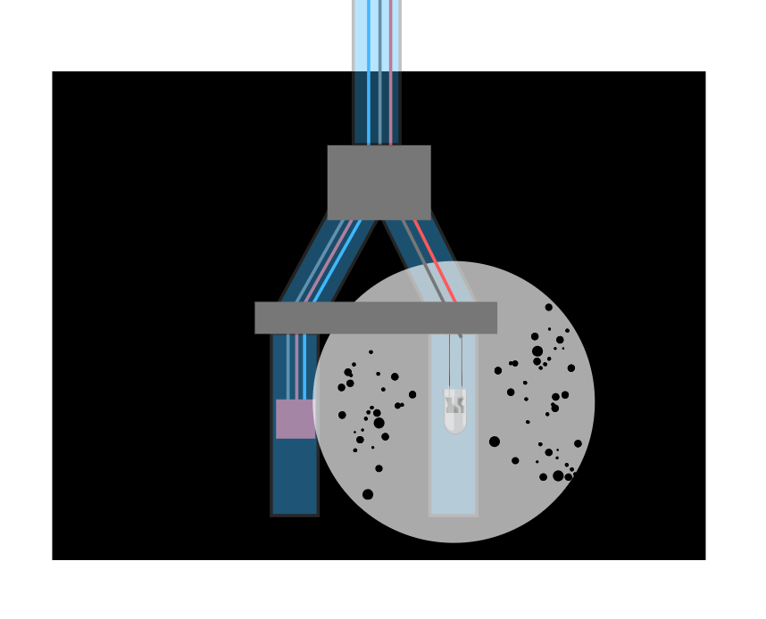

#### Sonu Kapoor, Saul Bernaber, Rishik Zaparde
 #### Oct 4, 2019

 **Make a note of having citations everywhere in the report so our amazing RA does not yell at us!**
 **for the future - images of plans**

 ## Abstract
 Sensor Development's goal is to develop affordable sensors with readily available materials to monitor and report water quality in the water treatment processes in AguaClara plants and labs. In Fall 2019, the subteam worked on two different projects that were slight modifications from the previous semester. The subteam worked on a second prototype of a Sludge Blanket Detector(SBD) for the upcoming Honduras trip. Additionally, the subteam also started designing a low-cost turbidimeter that would measure the amount of dissolved organics as well as turbidity.

 ## Introduction

 The Sensor Development subteam creates sensors that monitor and report water quality during the water treatment process in AguaClara plants. While turbidimeters exist in the market, they cost upwards of $2000 USD and are often complicated to use. This subteam strives to create affordable and user-friendly sensors with readily available and replaceable parts. The goal is to streamline the measurement process, ensuring that it is not only user-friendly but also accurate. These sensors quantify the effectiveness of the treatment process by measuring the turbidity of the water at different stages of the treatment process, helping to catch problems as they arise.**change the wording to avoid implying that you detect problems as they arise**

 **what is turbidity (1-2 lines)**

 The subteam started a second prototype of the submersible sensor, which determines when the sludge blanket levels are rising. The ultimate goal for this sensor was to provide the plant operators with a cost-efficient and simple way to determine the height of the sludge blanket inside the floc hopper. This is critical to keep track of the rate at which the sludge blanket is rising.

 **what is a floc hopper? sludge blanket? why do we care if the rate is increasing?**

 The subteam also started working on a prototype of the low cost turbidity meter for dissolved organics. This project has two main parts - the infrared turbidity meter and the 450nm sensor. This project has been modified from last semester, where the plan was to use an ultraviolet 254nm light sensor. Switching to the 450nm light made this project more economical, as the apparatus required for the UV light sources is more expensive. The turbidimeter is different from the team’s past projects, as it would measure both reflectance and absorbance of the light passing through the water sample. The subteam used an infrared LED and measure the light received directly across and at 90° from the light source. This resulted in a more accurate analysis of water purity, as it accounted for the absorbance of light. The primary use of this sensor will be to measure the amount of dissolved organics in the water - simply measuring turbidity wouldn’t suffice as dissolved organic matter is not always visible.

 **are the two parts separate? be more precise**

 **what wavelengths do conventional turbidimeters use**

 **typical wavelengths for dissolved organics**
 **254 and 450 both are abosorbed by organic matter; what organic matter absorbs what wavelength?**
 **list of organic matter that absorbs 450nm - talk to Humic acid**

 ## Previous Work

 **remove first three paragraphs - incorporate contents from

 During the Fall 2017 and Spring 2018 semesters, the subteam began developing the MAPE **acronym** turbidity sensor, which can be lowered into **floc hopper** to measure the distance to the sludge blanket. The sensor utilized an endoscope, a thin, tube-shaped device that has a small camera at one end and a USB connection at the other, to take live images of the water. These images would be collected and processed for average light intensity by the mobile application. This sensor enables the calculation of the fluid turbidity from each image. To obtain average light intensity, the image would then be processed in the mobile app, using an empirically **experimentally** obtained correlation between turbidity and the intensity of reflected light, as well as offset for any light detected during calibration in clear fluid. The goal of this sensor was to readily measure water turbidity and determine the height of the sludge blanket in a **floc hopper**. **first and last sentence is the same**

 Additionally, the subteam worked on the MIA **acronym** sensor, which housed an analog photodiode (a semiconductor that converts light to electrical current), an LED light source, and a microcontroller inside a portable case. Similar to the MAPE turbidity sensor, the MIA sensor measured the fluid turbidity using light intensity. However, this sensor detected light passing through the fluid using a photodiode, which is more reliable and less susceptible to noise. The microcontroller reads the data from the photosensor and converts it into turbidity values using a relation established through calibration testing. This sensor served as a prototype for a larger device that would function similarly to the MAPE turbidity sensor, providing treatment plant operators with affordable and user-friendly methods of determining fluid turbidity and sludge blanket height.

 During Fall 2018, the FBSD **acronym** was redesigned with a new casing and new components to improve the modularity of the design. A lot of thought was put into how to make the sensor easy to use, since the team wanted to ensure complete flexibility in terms of usage. This involved allowing the user to replace faulty photosensors and LEDs, which would allow for the casing and apparatus to remain the same throughout experiments. Although the calibration curve has not yet been developed, the Fall 2018 design has proven to be easier to use than the previous iterations, and also has definitively solved some of the problems of both the first and second versions of the sensor. One major issue that this has resolved is that the previous iteration was not hard shelled and thus it was flexible and prone to movement. This caused the placing of the sensor and LED to change with each testing. This consequently caused a small variance in the light intensity readings, which the hard, inflexible casing of the new sensor resolves.

 In the Spring 2019 semester, the team tested this sensor to develop an absorbance-voltage relation and finalized the prototype for in-lab use, as well as the in-lab fluidized bed solids detector (FBSD) **purpose first, design second** that was prototyped in Fall 2018 using 3D printing and embedded circuitry. The goal of this sensor was to provide the High Rate Sedimentation (HRS) team with a quick method of testing the concentration of clay particles within their testing parameters. Additionally, the subteam looked into submersibility design options for the turbidity sensor and ways to waterproof the sensor without compromising on accuracy.

 The subteam also finished prototyping the Microcontroller-Interfaced Analog (MIA) and developed a mobile application for the Mobile Application-Processed Endoscope (MAPE) turbidity sensors, which were two design ideas the subteam developed for the submersible sensor the previous semester. The MIA sensor determines when the sludge blanket levels are rising. The MAPE turbidity sensor connects an endoscope to an Android smartphone and displays the live feed from the endoscope camera, using the light intensity from the images collected to determine the water turbidity. The ultimate goal for these sensors was to provide the treatment plant operators with a cost-efficient and simple way to determine the height of the sludge blanket inside the floc hopper. This is critical to keep track of the rate at which the sludge blanket is rising. Using the UVCCamera library found [here](https://github.com/saki4510t/UVCCamera), the team was able to get the app connected to the endoscope. Upon being connected to a smartphone via USB, the live feed from the endoscope was displayed on the screen. While this part of the app was successful, other tasks, such as incorporating the image processing code created in past semesters and fixing the exposure/white balance of the image, have not been implemented yet. Other libraries may have to be used in conjunction with the UVCCamera library in order to process the images.

In Fall 2019, the MAPE app was revisited due to problems surrounding controlling the aperture and exposure of the endoscope, which was interfering with turbidity readings. After looking through the UVCCamera library, it was determined that the MAPE app could no longer be pursued as a viable option. It appears that the code regulating the endoscope's aperture and exposure is embedded in the endoscope itself, which would mean that an external application (i.e. the MAPE app) would not be able to create consistent lighting conditions for turbidity readings.

 ## Fabrication Details

 ### Fabrication Details for the Sludge Blanket Detector

 The Sensor Development team has begun work on fabricating the Sludge Blanket Detector. The original design was theorized to have a few problems and was thus changed to be completely covered in its surroundings. More specifically, in the original design, the sensor was surrounded by a clear case all around. This allowed for outside light to affect the readings of the sensor. This will allow for the light absorb to be purely coming from the LED and not from reflected or refracted light from the surface.**write more about how the previous design allowed water /and how it affects the reading (turbidity?)** Moving away from using cuvettes to seal the sensor and LED, PVC will be used, in combination with PVC cement. The figure below, Figure 2, shows a schematic of the old plans for the sensor. (Reference relative dimensions? - SB) **canva**

 
 **Figure 2:** Original Design: Shows the schematic for the MIA sensor. The red wires represent wires to the power source, the black to ground, and the blue to the signal.

 ## Special Components

 ### Special Components for the Submersible Sludge Blanket Detector **be consistent with name (remove "submersible")**

 - The photosensor used was the TEMT6000 Ambient Light Sensor from developer SparkFun. TEMT6000 is a silicon NPN epitaxial planar phototransistor in a miniature transparent mold for surface mounting onto a printed circuit board. The device is sensitive to wavelengths from 390 nm to 700 nm. Even as we changed from 254 nm light to 450 nm, the photosensor can still be utilized. It is available [here](https://www.sparkfun.com/products/8688).

 - Because the code relies on the rate of change of light readings rather than the absolute value of light intensity, the LED used in this sensor is irrelevant and open to change. In the Spring 2019 iteration, the LED used was a small white LED **insert link here** **maybe** running on 3V, however any LED such as those from [here](www.sparkfun.com) would work well. **you actually care about stuff* **do not say you do not care** **voltage, size, power capacity, spectral line halfway**
 (if we are looking to use 450 nm light then we must change the LED? Look into this https://www.sparkfun.com/products/12062 - SB)

 ### Special Components for the Low-Cost Turbidimeter

- The Arduino Mega 2560 was bought from the distributor Digi-Key. Its part number is [1050-1018-ND](https://www.digikey.com/products/en?keywords=1050-1018-ND).
- The SD card module that works with the arduino was also bought from Digi-Key. Its part number is [1528-1462-ND](https://www.digikey.com/products/en?WT.z_se_ps=1&keywords=1528-1462-ND).
- The laser diode used is of infrared type with wavelength 850nm. Six models of the lasers were bought from the distributor Digi-Key. These are the part numbers: [365-1877-ND](https://www.digikey.com/products/en?keywords=365-1877-ND), [365-1878-ND](https://www.digikey.com/products/en?keywords=365-1878-ND), [365-1879-ND](https://www.digikey.com/products/en?keywords=365-1879-ND), [365-1880-ND](https://www.digikey.com/products/en?keywords=365-1880-ND), [365-1881-ND](https://www.digikey.com/products/en?keywords=365-1881-ND), and [365-1883-ND](https://www.digikey.com/products/en?keywords=365-1883-ND).
- Along with the laser diodes, five infrared sensors were also tested. These are most sensitive at 850nm wavelength. These were bought from [T.T. Electronics](https://www.ttelectronics.com/). The following table has relevant information regarding these sensors.
- Refer to table 1 for datasheets and links to the sensors mentioned above.
**Table 1. Details for sensors.**
Part number | Description | Datasheet Link
------------ | ------------- | -------------
OP830SL | Phototransistor, Photodarlington, NPN Silicon, TO-18 Dome Lens | [Datasheet](https://www.ttelectronics.com/TTElectronics/media/ProductFiles/Optoelectronics/Datasheets/OP800_830_SLandWSL.pdf)
OP804SL | Op804Sl IR Phototransistor, Through hole 3-pin TO-18 Package | [Datasheet](https://www.ttelectronics.com/TTElectronics/media/ProductFiles/Optoelectronics/Datasheets/OP800_830_SLandWSL.pdf)
OP805SL | Sensor, Opto switch assemble, transmissive, single channel; 5.1mm; 30V; 50mA | [Datasheet](https://www.ttelectronics.com/TTElectronics/media/ProductFiles/Optoelectronics/Datasheets/OP800_830_SLandWSL.pdf)
OP913WSL | Sensor, Opto switch assemble, transmissive, single channel; 3.8mm; 30V; 20mA | [Datasheet](https://www.ttelectronics.com/TTElectronics/media/ProductFiles/Optoelectronics/Datasheets/OP913.pdf)
OP812SL-OC | Photologic TO-18 | [Datasheet](https://www.ttelectronics.com/TTElectronics/media/ProductFiles/Optoelectronics/Datasheets/OPL800.pdf)
