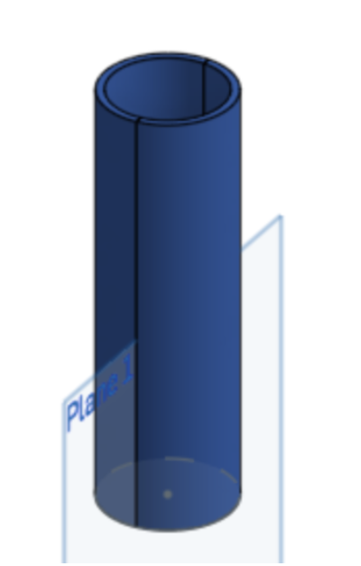
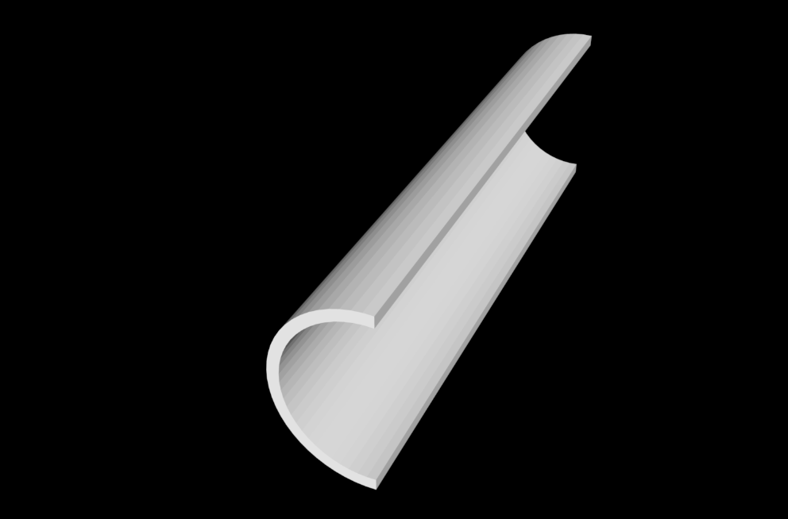
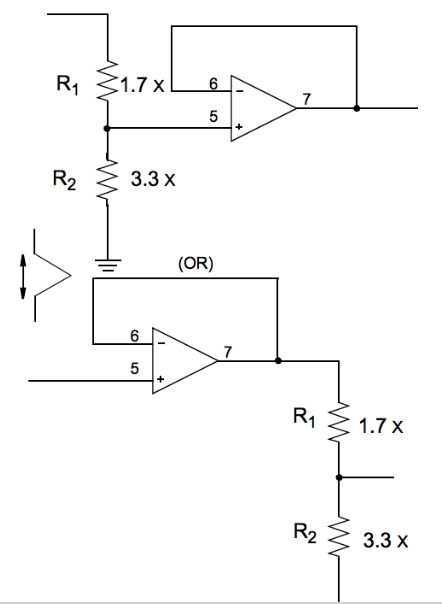
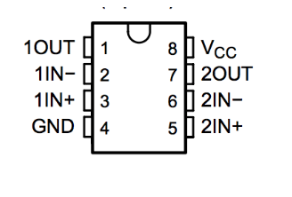
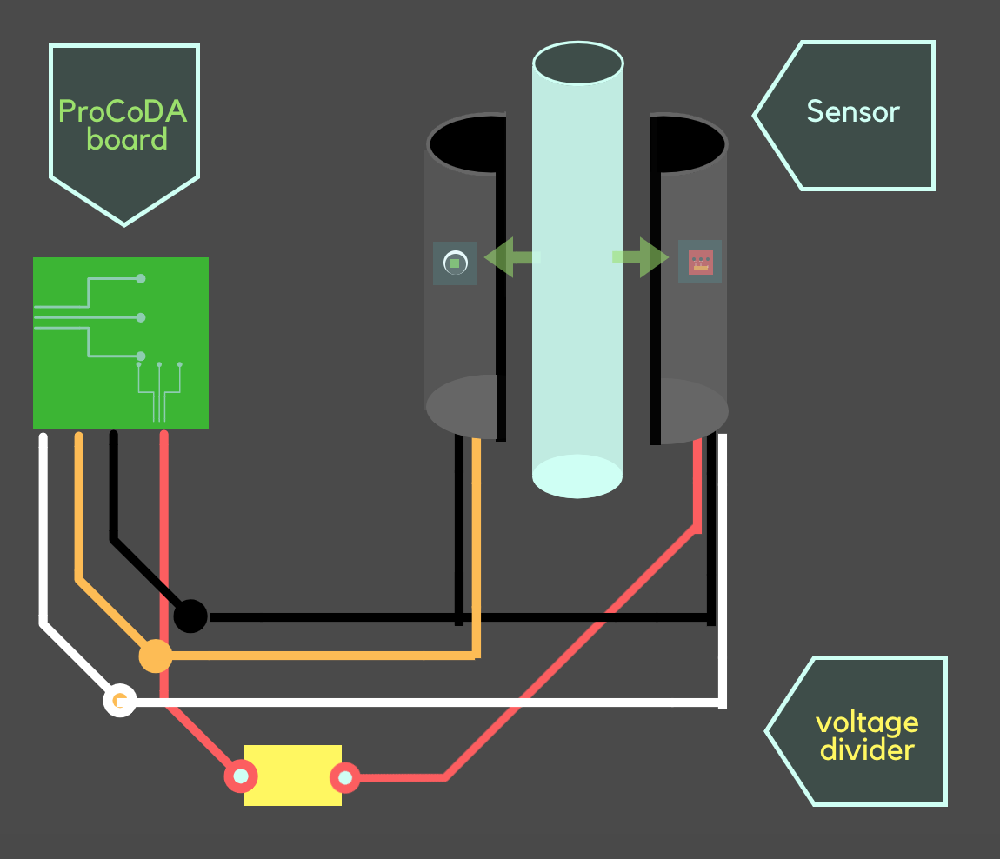

# Sensor Development, Spring 2019
#### Lois Lee, Lawrence Li, Srilekha Vangavolu, Sonu Kapoor
#### February 20, 2019

## Abstract
The objective of the Sensor Development subteam is to develop sensors to monitor and report water quality during the water treatment process in AguaClara plants. In previous semesters, the subteam developed a working prototype for an in-lab fluidized bed solids detector and made preliminary designs for a submersible sludge blanket detector. This semester the subteam will develop a calibration curve for the fluidized bed solids detector and will also work on creating a prototype for the sludge blanket detector. Additionally, the subteam is assisting on a design of a low-cost turbidimeter utilizing both the reflectance and absorbance of light.

## Introduction

The Sensor Development team aims to create sensors that monitor and report water quality during the water treatment process in an AguaClara plant. Specifically, these sensors can be used to quantify the effectiveness of the treatment process by measuring the turbidity of the water during and after different steps of the treatment process, helping to catch problems if they arise. Originally, in Spring 2017, the Sensor Development subteam worked on developing a gas measurement sensor that would help subteams such as the Anaerobic Fluidized Bed (AFB) Reactor and Upflow Anaerobic Sludge Blanket (UASB) wastewater subteams with their research.

The following semester, the subteam worked on a fluidized bed solids concentration sensor in order to measure the clay particle concentration in the high rate sedimentation portion of the water treatment process. Over the course of the Fall 2017 and Spring 2018 semesters, the subteam has concentrated on redefining the fluidized bed solids concentration sensor and building a submersible solids concentration sensor to measure turbidity.

In the Fall 2018 semester, the team redesigned the in-lab fluidized bed solids detector and made it more user-friendly by creating a user interface. The subteam  also developed a design for the finalized in-lab fluidized bed solids detector using 3D printing and embedded circuitry that will make the sensor both easier and safer to use in the future. The goal of this sensor to provide the High Rate Sedimentation (HRS) team with a fast method of testing the concentration of clay particles within their testing parameters.  In addition, the subteam has looked into submersibility design options for the turbidity sensor. The goal of the subteam is to finish prototyping the Microcontroller-Interfaced Analog (MIA) and the Mobile Application-Processed Endoscope (MAPE) turbidity sensors, which were two design ideas the subteam developed for the submersible sensor the previous semester. The ultimate goal for this sensor is mainly to provide the treatment plant operators with a way to determine the height of the sludge blanket in a way that is both cost-efficient and easy to use. This was especially necessary because it is currently impossible for the plant operators to have a real-time measurement of what occurs within the flocc hopper. This can help determine when the sludge blanket levels are rising. The sensors should help provide insight and information as to what is happening in the plants.

Additionally, with the guidance of Marcin, a new project was started this semester. The goal was to build a low-cost turbidimeter that measures the efficiency of each stage of the water purification plant. This project has two main parts - the turbidimeter and the 254 nm sensor. The turbidimeter is different from the team’s past projects, as it would measure both reflectance and absorbance of the light passing through the water sample. Plans were made to use an infrared LED and measure the light received directly across and at 90° from the light source. This would result in a more accurate analysis of water purity. In addition, the incorporation and usefulness of the 254 nm light was researched. This is crucial to measure the amount of organic matter in the water, as opposed to just particles suspended in the water.

## Previous Work

During the Fall 2017 and Spring 2018 semesters, the sensor development subteam worked on developing the mobile application-processed endoscope (MAPE) turbidity sensor, which can be lowered into sedimentation tanks to measure the distance to the sludge blanket. The sensor utilized an endoscope to take live images of the water, which would be collected and processed for average light intensity by the mobile application component. This sensor enabled the calculation of the fluid turbidity from each image. This calculation used an empirically obtained correlation between turbidity and the intensity of reflected light, as well as offset for any light detected during calibration in clear fluid. The goal of this sensor was to readily measure water turbidity and determine the height of the sludge blanket in a sedimentation tank.

During the Fall 2018 semester, the fluidized bed solids detector was redesigned with a new casing and new components to improve the modularity of the design. Because the team wanted to ensure complete flexibility in terms of usage, a lot of thought was placed into how to make the sensor easiest to use. This involved allowing the user to replace faulty photosensors and LEDs, which would allow for the casing and apparatus to remain the same throughout experiments. Although the calibration curve has not yet been developed, the design has proven to be easier to use than the previous iterations, and also has definitively solved some of the problems of both the first and second versions of the sensor.

Additionally, the subteam worked on the microcontroller-interfaced analog (MIA) sensor, which houses an analog photodiode, a LED light source, and a microcontroller within a portable casing. Similar to the MAPE turbidity sensor, the MIA sensor measures the fluid turbidity using light intensity. However, this sensor detects light passing through the fluid using a photodiode, which is more reliable and less susceptible to noise. The microcontroller reads the data from the photosensor and converts it into turbidity values, using a relation established through calibration testing. This sensor serves as a prototype for a larger device that will function similarly to the MAPE turbidity sensor, providing treatment plant operators with affordable and user-friendly methods of determining fluid turbidity and the height of the sludge blanket.

## Methods

The methodology of attaining a calibration curve has been listed in experimental methods. To use the fluidized bed solids detector for the HRS team apparatus, the following steps must be taken.

1. Connect the sensor to ProCoDA
2. Attach to the 1-in PVC tube by placing both sides of the sensor around the tube. Because of the magnets on the sides, the sensor should clasp well on its own.
3. Using ProCoDA read the voltage values and use the subsequent calibration curve to determine the corresponding concentration/turbidity.

*Note: the calibration curve is still being developed.*

### Conclusions

The main conclusions gained from Fall 2018 semester were mostly regarding modularity of design. Because the team wanted to ensure complete flexibility in terms of usage, a lot of thought has been placed into how to make the sensor easiest to use. This involved allowing the user to replace faulty photosensors and LEDs which would allow for the casing and apparatus to remain the same throughout experiments. Although the calibration curve has not yet been developed, the design has proven to be easier to use than the previous iterations, and also has definitively solved some of the problems of both the first and second versions of the sensor.

### Future Work

The team was not able to test due to complications that arose in the circuitry of the 5V to 3.3V voltage step down. Once this issue is resolved, the testing and calibration curve can be developed using methods that have been proven to work for the previous iterations which have been outlined in this paper. The team will also begin work on the submersible sensor which had been delayed due to the current project in Spring 2019.

## Fabrication Details

### Fabrication for the Fluidized Beds Solids Detector

#### Casing

The main fabrication for the Fluidized Beds Solids Detector is creating a hard shell that allows the sensor to be more user friendly. The hard shell is made using the software OnShape to create a 3D model of the casing that is eventually printed in a 3D printer. The model is designed by creating a hollow circular base with an inner radius of 0.875 inches and an outer radius of 1.0 inch. Then the base is extruded 6.5 inches and cut in half using a plane that runs parallel to the sensor.

**Figure 1: The model created using the software OnShape. The plane shown above separates the two parts of the sensor.**

The dimension of the diameter of the sensor was designed to create a tight fit for the 1-inch PVC pipe, while also leaving enough room for a layer of foam to house the electronics. The 1-inch PVC pipe was used because the sensor is meant to fit around the HRS team’s apparatus which uses the 1-inch PVC pipe.  The length was an optimization in order to minimize exposure to outside light while allowing for a good fit on the HRS team’s apparatus. To fit properly between the casing and the pipe, the foam should be 2.48 inches wide, 0.18 inches deep and 6.25 inches long. Both the LED and the photosensor are embedded within the foam opposing each other in the center of each side of the sensor.

**Figure 2: The model created using the software OnShape. Two copies of this model are 3D printed in order to create a complete casing that will surround the pipe that the sensor will be used on.**

After the casing is printed, a layer of foam is epoxied to the inner wall of each side of the casing. The edges of the foam are cut with an X-Acto knife to make sure the foam fits flush with the outer casing and aligns parallel with the edge where the two pieces of the casing come together. Magnetic tape is glued along the length of the casing on the thin, flat surfaces where the two parts of the casing attach together. The magnetic tape is aligned so that when the two shells are attached, they form a cylinder with flush outer walls. In testing, the magnets have been strong enough to hold the two parts of the casing together and create a secure clasp for the sensor.

Cutouts are made in the middle of each piece of foam to fit an LED on one side and a photosensor on the other. The LED and the photosensor are glued to the foam and wires (ground, power, signal) are soldered to these components, looping behind the foam layer and coming out on the bottom of the cylindrical casing, where they are soldered to headers that external cables can plug into, allowing the photosensor and the LED to connect to ProCoDa.

The ground, power, and signal wires are marked and color-coded on the outside of the bottom of the casing so the user will know how to connect external wires properly.

#### Circuitry

In order to step the 5V from ProCoDA to 3.3V for the LED, we used a simple voltage divider with unity gain, for which a circuit diagram has been attached below:

**Figure 3: A standard 5V to 3.3V voltage divider with unity gain.**

As shown above, any combination of resistors with the ratio 1.7 to 3.3 can be used. However, because the voltage limit on the LED was 3.3V, the LED was at a risk of burning out if the voltage from the circuit went over 3.3V. Thus the resistor value was increased to a ratio of 2.1 to 3.3 and thus the circuit used has resistor values of 33 ohms and 21 ohms.

The op amp used was an older 16 pin model with a total of 4 internal op amps mainly due to a shortage of electrical components, however this is unnecessary excess and in the future we will  most likely revert to an 8 pin op amp with 2 internal op amps such as the LM258 or LM358 model as can be seen in the following diagram:

**Figure 4: The pinout diagram for a standard 8 pin op amp with GND and +VCC inputs.**

The last step was to connect the ProCoDA board to the sensor and LED inputs and outputs. There were a total of 4 wires stemming from the ProCoDA board: ground (GND), power for the sensor (VCC), power for the LED (LED), and signal (S). The connections for the LED and sensor were: signal from sensor, ground for sensor, ground for LED, power for sensor, power for LED.

The grounds were all soldered together, and the sensor voltage (VCC) was connected directly to the sensor power. The signal from the sensor was likewise soldered directly to the signal on the board. However, the power for LED provided by the board is 5V, so this is where the voltage divider with unity gain was placed, and it outputs into the LED power.

**Figure 5: A diagram of the wiring schematic used.**

## Special Components

### Special Components for the Fluidized Beds Solids Detector

- The photosensor used is the TEMT6000 Ambient Light Sensor made by SparkFun. TEMT6000 is a silicon NPN epitaxial planar phototransistor in a miniature transparent mold for surface mounting onto a printed circuit board. The device is sensitive to wavelengths from 390 nm to 700 nm. It is available [here](https://www.sparkfun.com/products/8688).

- We also utilized an LED from adafruit, available [here](https://www.adafruit.com/product/1626). The LED has dimensions of 12 mm by 40 mm. This LED is the best choice because it is a plastic diffused backlight, allowing even distribution of light throughout the system, which will minimize the effect on the calibration curve that the positioning of the photosensor may create.

- The other parts necessary for this sensor are wire and female and male headers which are commonly available. They are also available as [female headers](https://www.adafruit.com/product/2940) and [male headers](https://www.adafruit.com/product/3009) on Adafruit as well. Standard op amps are available in the market, some common ones include LM258 or LM358 which can be purchased by most electrical components vendors or can be purchased in bulk from the original manufacturers, [Texas Instruments](http://www.ti.com/product/LM258).

## Experimental Methods
### Set-up:

#### Current Experimental Methods
Due to complications in circuitry, the testing phase has not yet commenced. The problem caused the LED to flicker, and a steady light intensity is an uncompromisable part necessary to develop an accurate calibration curve. Until this problem is fixed, the team will not be able to begin experiments.

#### Future Experimental Methods

To develop a voltage-concentration relation for the fluidized bed solids detector, the subteam will attach it to the High Rate Sedimentation recirculator (straight PVC pipe) and experiment with fluids of known solids concentration and turbidity. The photosensor will output a voltage reading based on the amount of light absorbed. This recorded voltage output data will be analyzed and compared to the known concentrations of the fluids to produce a relation between concentration and absorbance, and thus concentration and voltage.

The subteam will use this calculated voltage-concentration relation to test the sensor on fluids of different known concentrations and record the calculated concentrations from the sensor. As a result, the team can test the accuracy of the photosensor and our relation formulas by comparing the measured concentration/turbidity data to the actual concentrations of the fluids. The team will perform 3 trials with 10 known concentration values ranging from 0.00 g/mL to 0.035 g/mL with an interval of 0.005 g/mL between each reading.

In the future, it may also be necessary to test the effects of different types, particularly different colors, of sediment on the turbidity readings. However, the team is not yet at the testing phase and have no experimentation details yet to report.
