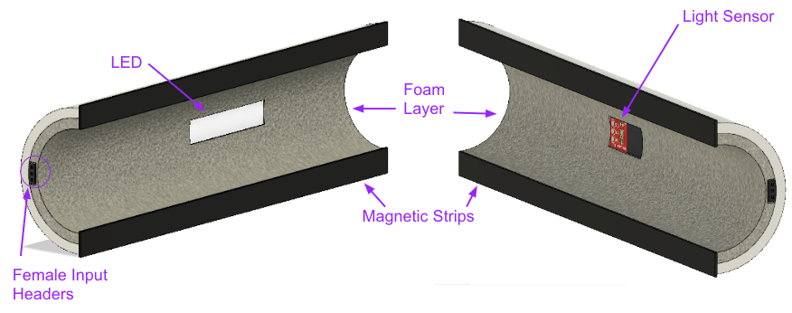
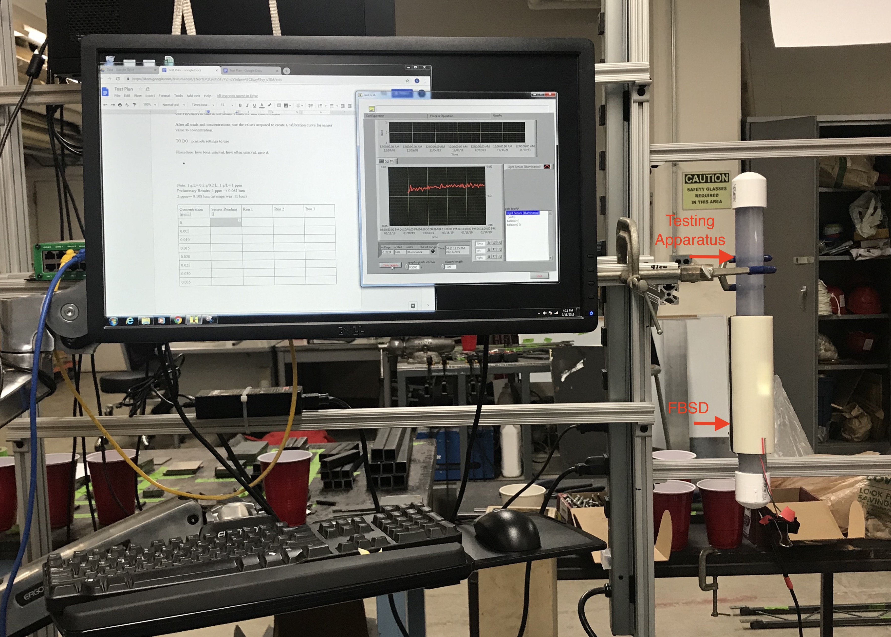
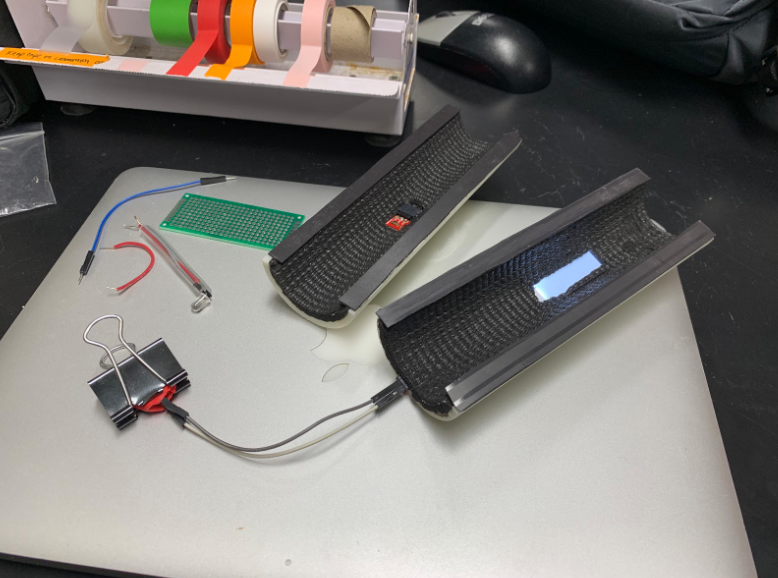

# Sensor Development, Spring 2019
#### Lois Lee, Lawrence Li, Srilekha Vangavolu, Sonu Kapoor
#### May 3, 2019

**[Hello! I will be making comments in these bold brackets. If they are simple grammar corrections feel free to delete the bracketed comment as soon as it is corrected. Otherwise, keep them and the next time around they will be deleted by the graders.]**

**[Overall: Good job! There are still issues with tenses. Make sure you have someone proofread the whole report to get rid of those before the final submission. Label your tables and refer to tables and figures in the text.]**

## Abstract
The Sensor Development subteam’s goal was to develop low-cost sensors with readily available materials to monitor and report water quality in the water treatment processes in AguaClara plants. In Spring 2019, the subteam developed a calibration curve for the Fluidized Bed Solids Detector, prototyped a Sludge Blanket Detector, and finished developing the Mobile Application-Processed Endoscope. Additionally, the subteam started designing a low-cost turbidimeter utilizing both the reflectance and absorbance of light.

## Introduction

The Sensor Development subteam creates sensors that monitor and report water quality during the water treatment process in AguaClara plants. While there exists turbidimeters in the market, they cost upwards of $2000 USD and are often complicated to use. This subteam strives to create affordable and user-friendly sensors with readily available and replaceable parts. The goal is to streamline the measurement process, ensuring that it is not only user-friendly but also accurate. These sensors quantify the effectiveness of the treatment process by measuring the turbidity of the water at different stages of the treatment process, helping to catch problems if they arise.

This semester, the subteam tested the in-lab fluidized bed solids detector (FBSD) that was prototyped in Fall 2018 using 3D printing and embedded circuitry. The goal of this sensor was to provide the High Rate Sedimentation (HRS) team with a quick method of testing the concentration of clay particles within their testing parameters. Additionally, the subteam looked into submersibility design options for the turbidity sensor and ways to waterproof the sensor without compromising on accuracy.

The subteam also finished prototyping the Microcontroller-Interfaced Analog (MIA) and developed a mobile application for the Mobile Application-Processed Endoscope (MAPE) turbidity sensors, which were two design ideas the subteam developed for the submersible sensor the previous semester. The MIA sensor determines when the sludge blanket levels are rising. The MAPE turbidity sensor connects an endoscope to an Android smartphone and displays the live feed from the endoscope camera, using the light intensity from the images collected to determine the water turbidity. The ultimate goal for these sensors was to provide the treatment plant operators with a cost-efficient and simple way to determine the height of the sludge blanket inside the floc hopper. This is critical to keep track of the rate at which the sludge blanket is rising.

Additionally, a new project was started this semester with the guidance of Marcin Sawczuk, a PhD student working with Professor Monroe Weber-Shirk. The goal was to build a low-cost turbidimeter that measures the efficiency of each stage of the water purification plant. This project has two main parts - the turbidimeter and the 254 nm sensor. The turbidimeter is different from the team’s past projects, as it would measure both reflectance and absorbance of the light passing through the water sample. Plans were made to use an infrared LED and measure the light received directly across and at 90° from the light source. This would result in a more accurate analysis of water purity, as it accounts for absorbance of light. In addition, the usefulness of the 254 nm light was researched and plans were made to incorporate the light in the design of the turbidimeter for Marcin's project in the future semesters **[Incorporate it into what? the current design of the turbidimeter?]**. This ultraviolet wavelength can be used to measure the amount of organic matter in the water, as organic matter absorbs this wavelength easily.

## Previous Work

During the Fall 2017 and Spring 2018 semesters, the subteam began developing the MAPE turbidity sensor, which can be lowered into sedimentation tanks to measure the distance to the sludge blanket. The sensor utilized an endoscope, a thin, tube-shaped device that has a small camera at one end and a USB connection at the other, to take live images of the water. These images would be collected and processed for average light intensity by the mobile application. This sensor enables the calculation of the fluid turbidity from each image. To obtain average light intensity, the image would then be processed in the mobile app, using an empirically obtained correlation between turbidity and the intensity of reflected light, as well as offset for any light detected during calibration in clear fluid. The goal of this sensor was to readily measure water turbidity and determine the height of the sludge blanket in a sedimentation tank.

Additionally, the subteam worked on the MIA sensor, which housed an analog photodiode (a semiconductor that converts light to electrical current), an LED light source, and a microcontroller inside a portable casing. Similar to the MAPE turbidity sensor, the MIA sensor measured the fluid turbidity using light intensity. However, this sensor detected light passing through the fluid using a photodiode, which is more reliable and less susceptible to noise. The microcontroller reads the data from the photosensor and converts it into turbidity values using a relation established through calibration testing. This sensor served as a prototype for a larger device that would function similarly to the MAPE turbidity sensor, providing treatment plant operators with affordable and user-friendly methods of determining fluid turbidity and sludge blanket height.

During the Fall 2018 semester, the FBSD was redesigned with a new casing and new components to improve the modularity of the design. A lot of thought was put into how to make the sensor easy to use, since the team wanted to ensure complete flexibility in terms of usage. This involved allowing the user to replace faulty photosensors and LEDs, which would allow for the casing and apparatus to remain the same throughout experiments. Although the calibration curve has not yet been developed, the Fall 2018 design has proven to be easier to use than the previous iterations, and also has definitively solved some of the problems of both the first and second versions of the sensor. One major issue that this has resolved is that the previous iteration was not hard shelled and thus it was flexible and prone to movement. This caused the placing of the sensor and LED to change with each testing. This consequently caused a small variance in the light intensity readings, which the hard, inflexible casing of the new sensor resolves. In the Spring 2019 semester, the team has tested this sensor to develop an absorbance-voltage relation and finalized the prototype for in-lab use. **[Write in past tense.]**

Please refer to Figure 1 for a cross-section of the sensor.

**Figure 1** Shows a cross-section of the CAD model of the FBSD. The full drawing can be seen [here](https://a360.co/2ULcyzV).  **[Refer to your figures in the text otherwise they are not being used and it is not as clear to the reader their purpose.]**

## Methods

The methodology of attaining a calibration curve has been listed in experimental methods. A calibration curve is used to determine the concentration of an unknown solution based on previous measurements of solutions of known concentrations. To use the FBSD for the HRS team apparatus, the following steps must be taken.

1. Connect the sensor to ProCoDA. **[Use consistent punctuation.]**
2. Attach the sensor**[the sensor]** to the 1-in PVC tube by placing both sides of the sensor around the tube. Because of the magnets on the sides, the sensor should clasp well on its own.
3. Using ProCoDA read the voltage values and use the subsequent calibration curve to determine the corresponding concentration/turbidity.

*Note: the calibration curve is still being developed.*

## Fabrication Details

### Fabrication Details for the Submersible Sludge Blanket Detector

The Sensor Development team has begun work on fabricating the Submersible Sludge Blanket Detector. The biggest challenge has been water-proofing the sensor, the LED and the subsequent wiring stemming from those components. The sensor and LED has been cased within cuvettes and sealed with a combination of PVC cement and epoxy. The figure below, Figure 2, shows a schematic of the plans for the sensor. Because the opening through which the sensor enters is close to an inch, the size of the sensor head must be as small as possible. **[Use past tense in the active voice in this paragraph. It sounds a bit strange right now as I'm pretending to be a ~future person~. Try to imagine yourself looking back at your paper when writing it.]**

**Figure 2:**  Shows the schematic for the MIA sensor. The red wires represent wires to the power source, the black toground, and the blue to the signal.

### Fabrication Details for the Fluidized Beds Solids Detector

This semester the Sensor Development team made minor adjustments to the design of the FBSD to make usage simpler. The casing, sensor, and light source remained **[remained]** the same, however instead of using an external 5V to 3V circuit the design included **[included]** a 3V battery connected directly to the LED. [Here is a link to the previous manual where you can see more about the fabrication for the Fluidized Beds Solids Detector.](https://github.com/AguaClara/sensor_dev/blob/master/2018_fall/Sensor%20Development%20Fall%202018.md)

In order to begin testing, the Sensor Development team also created a testing apparatus using the same 1 inch PVC pipe as the HRS team, capped and sealed with PVC cement at one end, and another removable cap at the other end. This made **[made]** it simpler to add and remove solutions of different concentrations to the tube.

Figure 3 shows the testing apparatus and the test setup in lab. Figure 4 shows the FBSD prototype that is being used currently for testing.

**Figure 3:** Testing apparatus and the test setup in lab. The 1 inch PVC pipe is shown on the right and is fixed using a clamp. 

**Figure 4:** Shows the prototype FBSD that is being used currently for all testing.

**[Refer to your figures in the text.]**

## Special Components

### Special Components for the Submersible Sludge Blanket Detector

- The photosensor used was **[was]** the TEMT6000 Ambient Light Sensor from developer SparkFun. TEMT6000 is a silicon NPN epitaxial planar phototransistor in a miniature transparent mold for surface mounting onto a printed circuit board. The device is sensitive to wavelengths from 390 nm to 700 nm. It is available [here](https://www.sparkfun.com/products/8688).

- Because the code relies **[does this need to be past tense?]** on the rate of change of light readings rather than the absolute value of light intensity, the LED used in this sensor is irrelevant and open to change. In the Spring 2019 iteration, the LED used was **[was]** a small white LED running on 3V, however any LED such as those from [here](www.sparkfun.com) would work well.

### Special Components for the Fluidized Beds Solids Detector

- The photosensor used is **[was]** TEMT6000 Ambient Light Sensor, which is **[was]** the same photosensor as for the Submersible Sludge Blanket Detector. It is available [here](https://www.sparkfun.com/products/8688).

- The LED used was **[was, I'm going to stop pointing these tense issues out, but please go back and fix them.]** from adafruit, available [here](https://www.adafruit.com/product/1626). The LED has dimensions of 12 mm by 40 mm. This LED was chosen due to its plastic diffused backlight, which allowed even distribution of light throughout the system, minimizing the effect on the calibration curve that the positioning of the photosensor may create.

- The other parts necessary for this sensor were **[were]** wire and female and male headers which are commonly available. They are also available as [female headers](https://www.adafruit.com/product/2940) and [male headers](https://www.adafruit.com/product/3009) on Adafruit as well. Standard op amps are available in the market, some common ones include LM258 or LM358 which can be purchased by most electrical components vendors or can be purchased in bulk from the original manufacturers, [Texas Instruments](http://www.ti.com/product/LM258).

### Special Components for the Low-Cost Turbidimeter

- The Arduino Mega 2560 was bought from the distributor Digi-Key. Its part number is [1050-1018-ND](https://www.digikey.com/products/en?keywords=1050-1018-ND).

- The SD card module that works with the arduino was also bought from Digi-Key. Its part number is [1528-1462-ND](https://www.digikey.com/products/en?WT.z_se_ps=1&keywords=1528-1462-ND).

- The laser diode used is of infrared type with wavelength 850nm. Six models of the lasers were bought from the distributor Digi-Key. These are the part numbers: [365-1877-ND](https://www.digikey.com/products/en?keywords=365-1877-ND), [365-1878-ND](https://www.digikey.com/products/en?keywords=365-1878-ND), [365-1879-ND](https://www.digikey.com/products/en?keywords=365-1879-ND), [365-1880-ND](https://www.digikey.com/products/en?keywords=365-1880-ND), [365-1881-ND](https://www.digikey.com/products/en?keywords=365-1881-ND), and [365-1883-ND](https://www.digikey.com/products/en?keywords=365-1883-ND).

- Along with the laser diodes, five infrared sensors were also tested. These are most sensitive at 850nm wavelength. These were bought from [T.T. Electronics](https://www.ttelectronics.com/). The following table has relevant information regarding these sensors.

- Refer to table 1 for datasheets and links to the sensors mentioned above.

**[Label your table! Table labels go at the top. i.e. Table 1. Blah balh ablah and don't forget to refer to it in your text!]**
**Table 1. Details for sensors.**

Part number | Description | Datasheet Link
------------ | ------------- | -------------
OP830SL | Phototransistor, Photodarlington, NPN Silicon, TO-18 Dome Lens | [Datasheet](https://www.ttelectronics.com/TTElectronics/media/ProductFiles/Optoelectronics/Datasheets/OP800_830_SLandWSL.pdf)
OP804SL | Op804Sl IR Phototransistor, Through hole 3-pin TO-18 Package | [Datasheet](https://www.ttelectronics.com/TTElectronics/media/ProductFiles/Optoelectronics/Datasheets/OP800_830_SLandWSL.pdf)
OP805SL | Sensor, Opto switch assemble, transmissive, single channel; 5.1mm; 30V; 50mA | [Datasheet](https://www.ttelectronics.com/TTElectronics/media/ProductFiles/Optoelectronics/Datasheets/OP800_830_SLandWSL.pdf)
OP913WSL | Sensor, Opto switch assemble, transmissive, single channel; 3.8mm; 30V; 20mA | [Datasheet](https://www.ttelectronics.com/TTElectronics/media/ProductFiles/Optoelectronics/Datasheets/OP913.pdf)
OP812SL-OC | Photologic TO-18 | [Datasheet](https://www.ttelectronics.com/TTElectronics/media/ProductFiles/Optoelectronics/Datasheets/OPL800.pdf)

### Special Components for the MAPE Turbidity Sensor
- The USB-connected endoscope used is the Depstech T01 USB-C Endoscope. It is designed for use with Mac and Windows computers, as well as Android smartphones. The device is available [here](http://www.depstech.com/?portfolio=depstech-t01).

## Experimental Methods
### Set-up:

#### Current Experimental Methods
1. Fill the testing apparatus with 200 mL of water. Measure out the amount of kaolin clay needed for a given concentration.
2. Pour kaolin clay into testing apparatus. Seal testing apparatus with the pipe cap.
3. Open up ProCoDA and click on sensors icon.
4. Initialize the light sensor. This is done by covering the light sensor, ensuring no light enters, and then pressing the zero button on the graph.
5. When the test is ready to be run, shake the testing apparatus and then place in the clamp. Once the tube is in the clamp, record data. **[not sure why you switched voice here? Change so it matches the other steps?]**
6. Initially the data has transient behavior due to air bubbles passing through and the mixing motion. However, after the transient behavior, there is a brief equilibrium where there is little change in the values. This is when the data should be recorded.

To develop a calibration curve for the FBSD, the subteam will attach it to the testing apparatus (and experiment with fluids of known solids concentration and turbidity. The photosensor outputs a voltage reading based on the amount of light absorbed. This recorded voltage output data will be analyzed and compared to the known concentrations of the fluids to produce a relation between concentration and absorbance, and thus concentration and voltage.

In the future semesters, the team should perform 3 trials with 10 known concentration values ranging from 0.00 g/mL to 0.035 g/mL with an interval of 0.005 g/mL between each reading. **[Are you talking about what you have done this semester? If so, use past tense. If this is instruction for future teams, write it as a command instead because this confused me.]**

#### Future Experimental Methods
To test the accuracy of the photosensor and the calibration curve, the subteam will use the calibration curve to test the sensor on fluids of different known concentrations and record the calculated concentrations from the sensor. By comparing the measured concentration data to the actual concentrations of the fluids, the accuracy can be verified.

In the future, it may also be necessary to test the effects of different types, particularly different colors, of sediment on the turbidity readings. However, the team is not yet at that testing phase and have no experimentation details yet to report.

## Results and Analysis
The MAPE app code from past semesters, which utilized the Android Camera API, was unable to connect to external USB cameras, so that app was effectively abandoned and the team began researching new implementations. The team looked into using the OpenCV and Camera2 libraries, but these apps were unsuccessful because these libraries may not have supported the specific camera used. Finally, using the UVCCamera library found [here](https://github.com/saki4510t/UVCCamera), the team was able to get the app connected to the endoscope. Upon being connected to a smartphone via USB, the live feed from the endoscope was displayed on the screen. While this part of the app was successful, other tasks, such as incorporating the image processing code created in past semesters and fixing the exposure/white balance of the image, have not been implemented yet. Other libraries may have to be used in conjunction with the UVCCamera library in order to process the images.

## References
**[Cite your references correctly. This is very lazy.]**
* [Spring 2018 Manual](https://github.com/AguaClara/sensor_dev/blob/master/manuals/manual_1.md)
* [Fall 2018 Manual](https://github.com/AguaClara/sensor_dev/blob/master/2018_fall/Sensor%20Development%20Fall%202018.md)
* [Program for endoscope](https://github.com/AguaClara/sensor_dev/tree/master/code/Endoscope%20Pilot%20Code)
* [Open source library utilized in endoscope program](https://github.com/saki4510t/UVCCamera)
