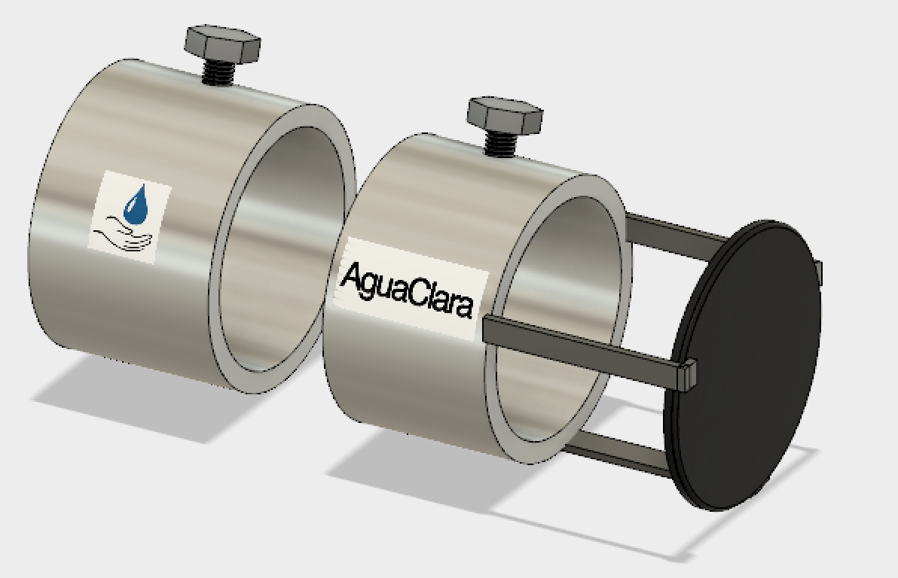
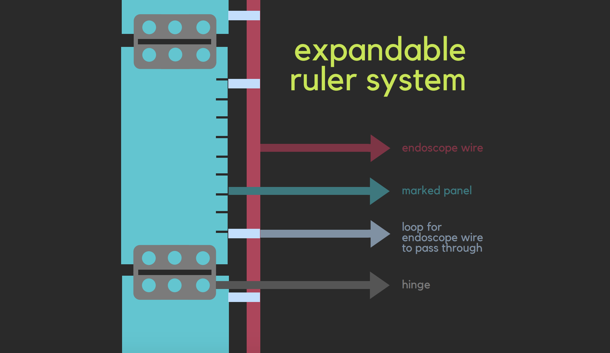
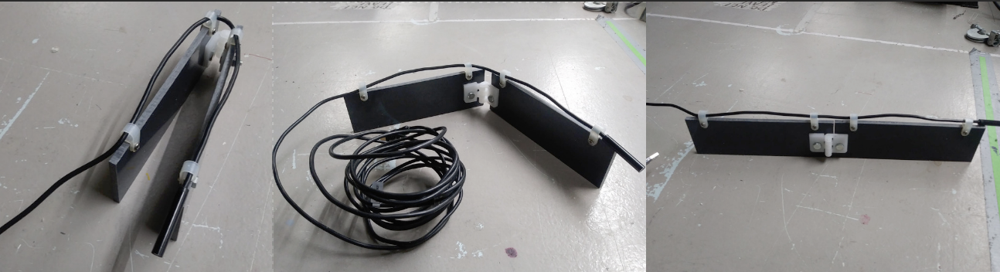

# Submersible Sensor

Throughout the semester, we will update this page with current tasks, projects completed,
and other things we want to have easy access to.

## About Us

Our goal is to create a lowcost but efficient concentration detector by essentially hijacking 
cheap endoscopes/borescopes and merging its function with code and physical additions of our own.
By designing a mobile application that utilizes image processing and basic equations relating 
the image values to concentrations, we can both get a visual of what is going on in each level of depth
and determine using a threshold value where the sludge blanket begins.

The current members of this subteam are
* Dana Owens (DLO49)
* Lawrence Li (LL678)
* Lois Lee (LL556) 

## Srilekha's CAD rendering of the MAPE design.

Here is the ruler system we are currently fabricating:

To learn more about the specifics of our subteam, please look through the tabs below.

* [Logbook](./logs/logs.md)
* [Manuals](./manuals/manuals.md)
* [Drawings](./drawings/drawings.md)
* [Code](./code/code.md)

## Current Tasks

  - Currently working on fabrication of an expandable ruler system for MAPE design.
  - Currently working on endoscope attachment fabrication and supplies.
  

Learn more about each of the [components](./components/components.md) of our sensor plan.

## Tasks:

### 3 sets of trials with 10 tests each:
We will have concentrations ranging from 0.00 -0.05 (g/mL) with intervals of 0.005

Interval | #1: 0 | #2: 0.005 | #3: 0.010  | #4:0.015 | #5: 0.020 | #6: 0.025 | #7: 0.030 | #8: 0.035 | #9: 0.040 | #10; 0.045 | #11: 0.050
--- | --- | --- | --- |--- |--- |--- |--- |--- |--- |--- |---
g of clay | 0 | 1.37500 | 2.7500 | 4.12500 | 5.50000 | 6.87500 | 8.25 | 9.62500 | 11 | 12.37500 | 13.75

#### repeat tests 3 times, with a total of 33 tests

The past members of this subteam are 

* Srilekha Vangavolu (SV397)
* Hannah Si (HS649)

